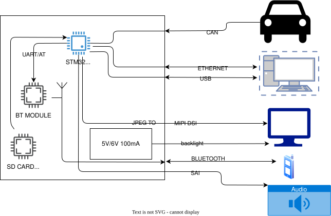

# MINIHAT

|  # | Interfejs              | Opis                                   |   HW  |   FW  |
| -: | ---------------------- | -------------------------------------- | :---: | :---: |
|  1 | CAN                    | Odbiór / (nadawanie) ramek CAN         | **K** | **V** |
|  2 | Ethernet (LAN8720)     | Podłączenie do komputera               | **V** | **V** |
|  3 | USB                    | Podłączenie do komputera               | **V** | **K** |
|  4 | MIPI (obsługa dotyku?) | Panel użytkownika                      | **K** | **K** |
|  5 | Bluetooth (sam moduł)  | Podłączenie do telefonu, odbiór muzyki | **K** | **K** |
|  6 | Wyjście audio          | Wyjście na głośniki                    | **V** | **K** |

# MCU
SMT32: 	H747IGTX

can 120ohm
usb 90ohm
ethernet ma 50ohm

# SRC
- [RM0399 Reference manual STM32H745/755 and STM32H747/757](https://www.st.com/resource/en/reference_manual/rm0399-stm32h745755-and-stm32h747757-advanced-armbased-32bit-mcus-stmicroelectronics.pdf)
- [Introduction to LCD-TFT display controller (LTDC) for STM32 MCUs](https://www.st.com/resource/en/application_note/an4861-introduction-to-lcdtft-display-controller-ltdc-on-stm32-mcus-stmicroelectronics.pdf)
- [DS STM32H747x](https://www.st.com/resource/en/datasheet/stm32h747ig.pdf)

## COMPONENTS SEARCH
- [display round](https://eu.mouser.com/ProductDetail/Newhaven-Display/NHD-2.1-480480AF-ASXP?qs=%252BXxaIXUDbq0eZ2IOf2mxVQ%3D%3D)