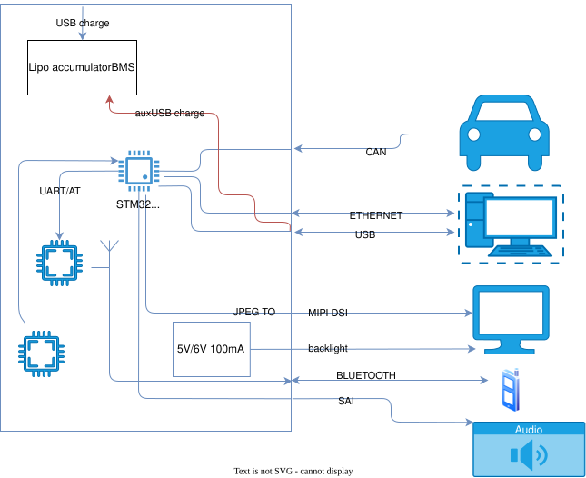

# MINIHAT

|  # | Interfejs              | Opis                                   |   HW  |   FW  |   MCU periph  |
| -: | ---------------------- | -------------------------------------- | :---: | :---: | :-----------: |
|  1 | CAN                    | Odbiór / (nadawanie) ramek CAN         | **K** | **V** |   FW          |
|  2 | Ethernet (LAN8720)     | Podłączenie do komputera               | **V** | **V** |   FW          |
|  3 | USB                    | Podłączenie do komputera               | **V** | **K** |   FW          |
|  4 | LTDC                   | Wyświetlanie informacji podstawowych   | **K** | **K** |   DSI HOST    |
|  5 | Bluetooth (bez anteny) | Podłączenie do telefonu, odbiór muzyki | **K** | **K** |   USART2      |
|  6 | Wyjście audio          | Wyjście na głośniki                    | **V** | **K** |   SAI         |
|  7 | DEBUG                  |                                        | **K** | **K** |   USART1      |
|  8 | Zasilanie płytki       | _proponowany_ akumulator ładowany z usb| -     | -     |               |
|  9 | QSPI                   | W25* qspi flash pamiec do grafiki      | **V** | **V** |   QSPI        |
| 10 | SD card                | konektor do podlaczenia karty sd       | **V** | **V** |   SDMMC       |

## MCU

SMT32: H747IGTX

can 120ohm
usb 90ohm  
ethernet ma 50ohm

## SRC

- [RM0399 Reference manual STM32H745/755 and STM32H747/757](https://www.st.com/resource/en/reference_manual/rm0399-stm32h745755-and-stm32h747757-advanced-armbased-32bit-mcus-stmicroelectronics.pdf)
- [Introduction to LCD-TFT display controller (LTDC) for STM32 MCUs](https://www.st.com/resource/en/application_note/an4861-introduction-to-lcdtft-display-controller-ltdc-on-stm32-mcus-stmicroelectronics.pdf)
- [DS STM32H747x](https://www.st.com/resource/en/datasheet/stm32h747ig.pdf)
- [SAI](https://www.st.com/resource/en/product_training/STM32F7_Peripheral_SAI.pdf)

## COMPONENTS SEARCH

- [ST antena design for STM32WB 2.4GHz](https://www.st.com/resource/en/application_note/an5129-low-cost-pcb-antenna-for-24ghz-radio-meander-design-for-stm32wb-series-stmicroelectronics.pdf)
- [BT chip](https://www.mouser.pl/ProductDetail/STMicroelectronics/BLUENRG-234N?qs=yqaQSyyJnNj1fpgr7V7RSw%3D%3D&mgh=1&vip=1)
- [BMS](https://www.instructables.com/Open-source-345S-Lithium-BMS/)
- [audio SAI](https://www.mouser.pl/pl/ProductDetail/Texas-Instruments/TAD5112IRGER?qs=sGAEpiMZZMutXGli8Ay4kL%252BYu9wReiUDFg5NaHxN6Qk%3D)
- [tcan332 D dcn](https://www.ti.com/lit/ds/symlink/tcan330.pdf?ts=1783928535596&ref_url=https%253A%252F%252Fwww.ti.com%252Fsitesearch%252Fen-us%252Fdocs%252Funiversalsearch.tsp%253FlangPref%253Den-US%2526nr%253D4%2526searchTerm%253Dtcan330dr)
- [TFP410 LTDC to HDMI driver](https://www.ti.com/lit/ds/symlink/tfp410.pdf?ts=1784099299498&ref_url=https%253A%252F%252Fwww.ti.com%252Fproduct%252FTFP410)
- [BT Schematic diagrams for STEVAL-IDB008V2](https://www.st.com/resource/en/schematic_pack/steval-idb008v2_schematic.pdf)
- [BT STEVAL-IDB008V2 Bill of materials](https://www.st.com/resource/en/bill_of_materials/steval-idb008v2_bom.pdf)
